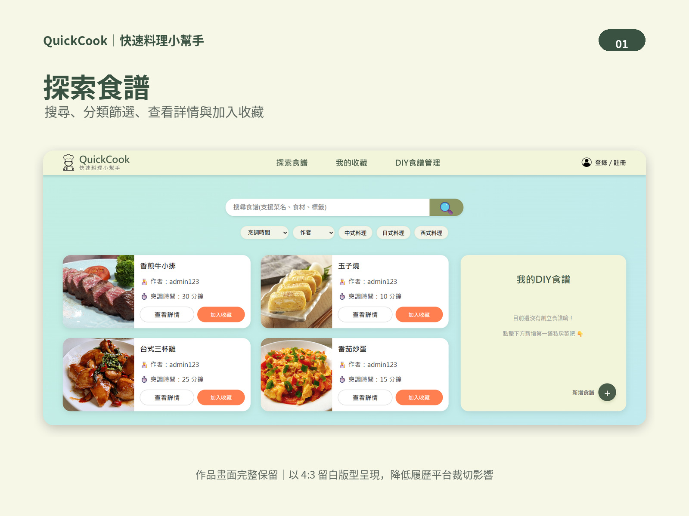
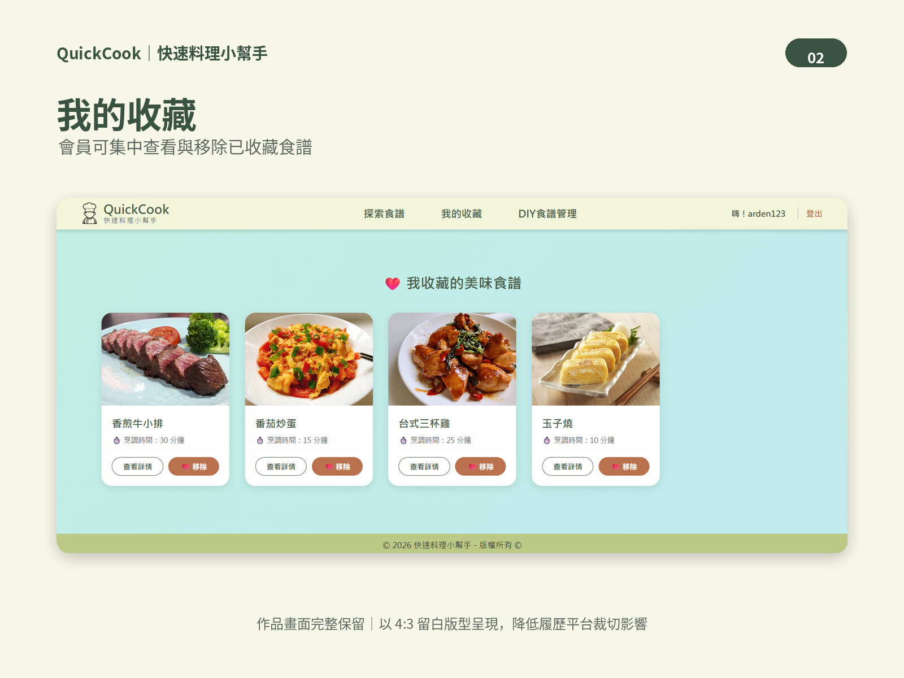
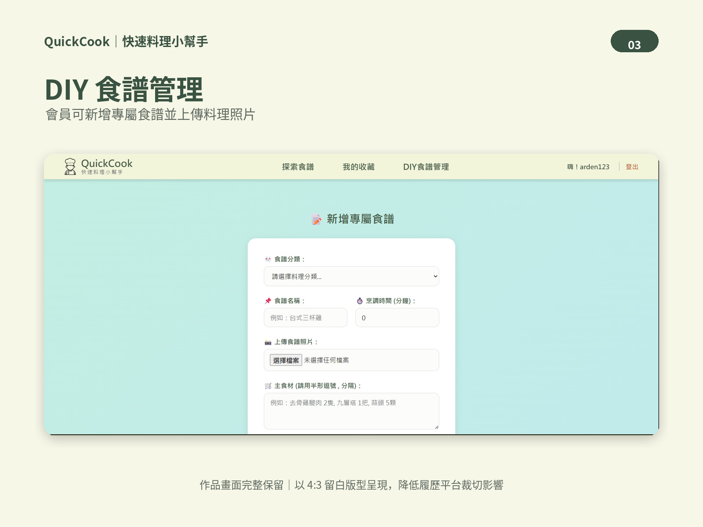
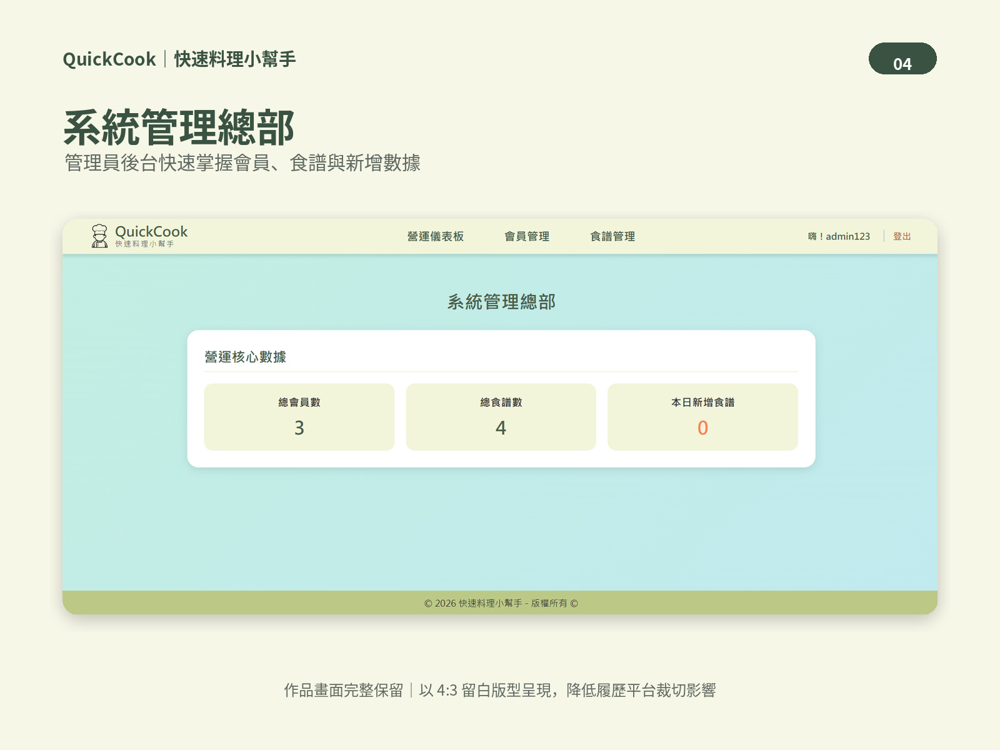
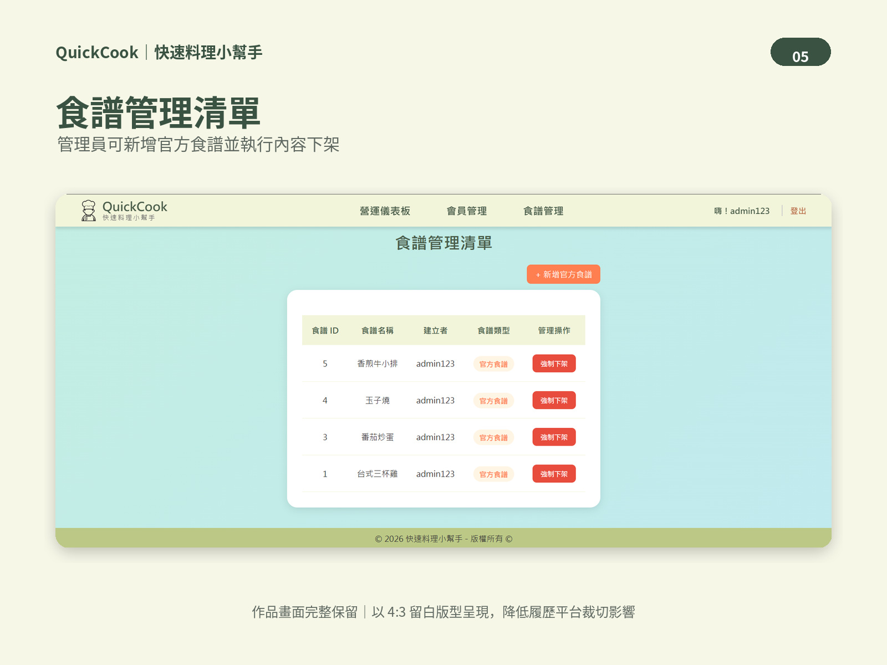

# QuickCook 快速料理小幫手

QuickCook 是使用 Java、Spring Boot 與 MySQL 開發的食譜分享平台。

提供會員註冊登入、DIY 食譜發布、圖片上傳、收藏與搜尋功能，
並提供管理員後台進行官方食譜與內容管理。

---

## 主要功能

- 會員註冊、登入、登出
- Session 身分驗證
- 一般會員 / 管理員角色權限管理
- DIY 食譜新增、修改、刪除
- 食譜圖片上傳
- 食譜收藏 / 取消收藏
- 多條件食譜搜尋
- 管理員後台
- 官方食譜管理

---

## 技術架構

### Backend
- Java
- Spring Boot
- Spring MVC
- Spring Data JPA
- Hibernate

### Database
- MySQL

### Frontend
- Thymeleaf
- HTML
- CSS

### Security
- Session Authentication
- BCryptPasswordEncoder
- Spring Interceptor

### DevOps
- Docker
- Docker Compose
- Git
- GitHub

---

## 系統架構

採用 Controller、Service、Repository 分層設計：

```text
Controller：接收前端請求，並呼叫 Service 層處理業務邏輯。
    ↓
Service：處理主要業務邏輯，並呼叫 Repository 層進行資料存取。
    ↓
Repository：透過 Spring Data JPA 與 MySQL 進行資料庫操作。
    ↓
MySQL：儲存會員、食譜、收藏等系統資料。
```

---

## 技術挑戰與問題解決

### 1. 食譜刪除與資料一致性

刪除食譜時，因收藏資料與食譜存在關聯，若直接刪除食譜會產生外鍵約束問題。

因此在 Service 層先刪除相關收藏紀錄，再刪除食譜資料，並使用 `@Transactional` 確保資料庫操作的一致性。

### 2. 圖片檔案管理

將圖片上傳與刪除邏輯封裝在 `FileStorageService` 中，並區分：

```text
images/
├── system/
└── recipes/
```

- `images/system/`：系統固定圖片
- `images/recipes/`：使用者上傳的食譜圖片

刪除食譜時只允許刪除 `recipes` 目錄下的圖片，避免誤刪系統圖片。

### 3. Docker 容器化與資料持久化

使用 Docker Compose 整合 Spring Boot 與 MySQL。

資料庫透過 Docker Volume 保存資料，圖片則透過目錄掛載方式保存，避免 Container 重新建立後資料消失。

### 4. 權限控管

使用 Session 儲存登入狀態，並透過 Spring Interceptor 限制管理員路由。

另外在 Service 層檢查食譜作者，避免使用者透過修改食譜 ID 刪除其他會員的資料。

---

## 專案執行方式

### 1. Clone 專案

```bash
git clone <https://github.com/EvanEagle/Quick-recipe-system>
cd quick-cook
```

### 2. 建立 `.env`

將 `.env.example` 複製一份並重新命名為 `.env`，再填入自己的資料庫帳號與密碼。

```env
DB_ROOT_PASSWORD=your_root_password
DB_USERNAME=your_username
DB_PASSWORD=your_password
```

### 3. 建立 Spring Boot JAR

Windows：

```bash
.\mvnw.cmd clean package -DskipTests
```

### 4. 啟動 Docker Compose

```bash
docker compose up --build -d
```

### 5. 開啟網站

```text
http://localhost:8080/quick-cook/home
```

### 6. 關閉服務

```bash
docker compose down
```

---

## 專案狀態

- ✅ 主要功能完成
- ✅ Docker 容器化
- ✅ MySQL 資料持久化
- ✅ 圖片持久化
- 🚧 公開雲端部署準備中

## 專案畫面

### 首頁


### 我的收藏頁


### DIY 新增食譜


### 管理員後台 - 後台營運儀表板


### 管理員後台 - 食譜管理
